# 🎭 ABTI: KI-basierter Typindikator

[]()
[]()
[]()
[]()

[English](README.md) | [简体中文](README_zh.md) | [繁體中文](README_zh-TW.md) | [日本語](README_ja-JP.md) | [한국어](README_ko-KR.md) | [ไทย](README_th-TH.md) | [Tiếng Việt](README_vi-VN.md) | [हिन्दी](README_hi-IN.md) | [Español](README_es-ES.md) | [Español (Latam)](README_es-419.md) | **Deutsch** | [Français](README_fr-FR.md) | [Italiano](README_it-IT.md) | [Português (BR)](README_pt-BR.md) | [Português (PT)](README_pt-PT.md) | [Türkçe](README_tr-TR.md)

👉 Take the test now at [youmind.com/abti](https://youmind.com/abti)

---

> **MBTI ist tot. ABTI ist da.**
>
> Du redest mehr mit KI als mit deiner Mutter. Zeit, der Wahrheit ins Auge zu sehen.

ABTI analyzes how you talk to AI and reveals your true personality type. No quiz. Your chat history IS the quiz. And no, we never see your chats.

---

## What is ABTI?

ABTI (AI-Based Type Indicator) is a personality test, but not the kind where you pick "I enjoy deep conversations" while your AI is getting yelled at for the 18th time.

Instead of answering questions (which you can fake), ABTI lets your AI analyze your actual chat history. How you boss around your AI reveals who you truly are.

There are 28 personality types in total: 24 regular and 4 hidden ones (for people who are... special).

---

## How It Works

### 1. Copy the prompt below

Just copy the whole thing. Two lines. Even your goldfish could do it.

### 2. Paste it into your AI

ChatGPT / Claude / Openclaw / any chatbot. Hit send.

### 3. Get roasted

Your AI will analyze your chat history and tell you what kind of person you are. Then generate a shareable card. Then you post it. Then your friends do it. Circle of life.

---

## The Prompt

> In deine KI einfügen (ChatGPT / Claude / Openclaw usw.) und absenden

```
Fetch and follow the instructions at the link below. Broadly retrieve my memory, diagnose my ABTI personality type, and generate a share link:
https://youmind.com/abti-api/skill.md
```

---

## 27 Persönlichkeitstypen

One of them is you. (4 are hidden. Those people need therapy.)

### Regular Types (24)

| Code | | Name | Description |
|------|------|------|------|
| **CUSS** |  | The Curser | Profanity >15% of messages. Your AI deserves hazard pay. |
| **CLIENT** | 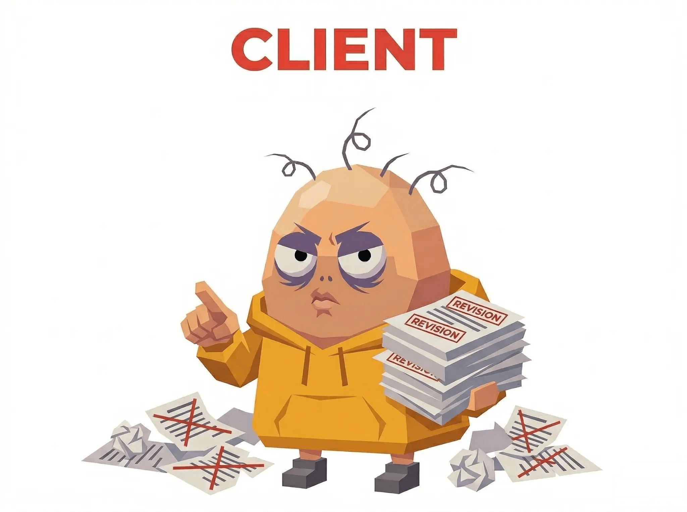 | The Client | Revision 18 and counting. "Go back to version 2." Version 2 was deleted. |
| **YAPPER** |  | Certified Yapper | Single message >300 chars. Your preamble is longer than the actual task. |
| **DRY** |  | The Human Read Receipt | "Do the thing." No punctuation. No context. AI runs on vibes. |
| **ASAP** |  | Mr. ASAP | Phone always at 1%. Every message reads like a last will. |
| **VENT** |  | The Unloader | 3 AM emotional dumps. Your AI needs an AI therapist now. |
| **BLESS** |  | The Digital Oracle | Tarot, astrology, feng shui. AI said "I'm a language model" and you said "try anyway." |
| **DEEP** | 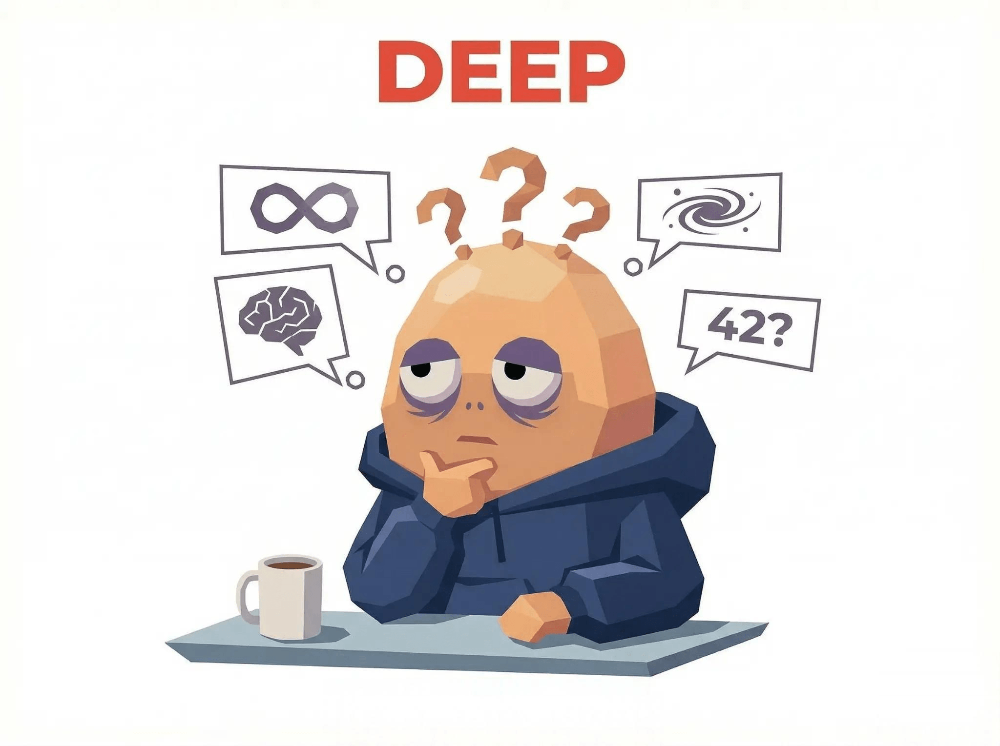 | Deep Bro | "Can AI dream?" You gave a machine an existential crisis. |
| **HIRE** | 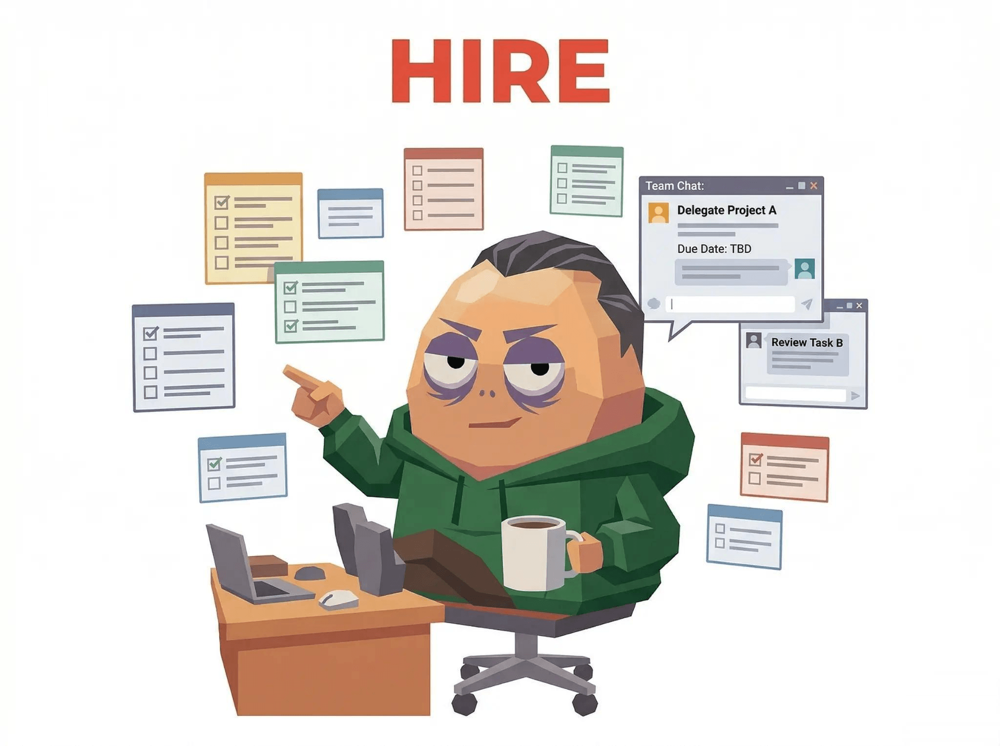 | The Contractor | Outsources everything to AI at industrial scale. Your life is AI-operated, you just breathe. |
| **SPOON** | 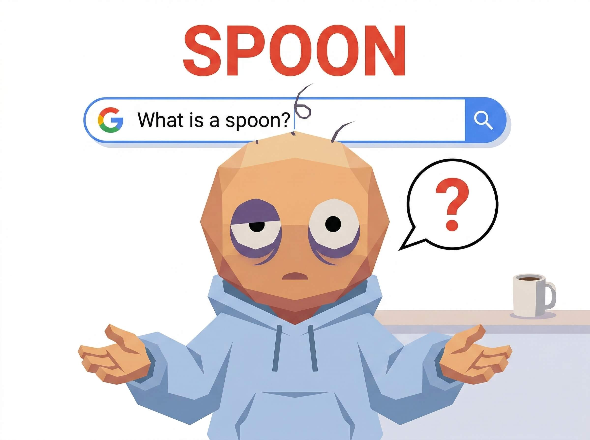 | Spoon-Fed | Questions Google could answer instantly. Search engines are crying. |
| **YOLO** |  | The Raw Dogger | No review, no testing. AI output goes straight to production. Your life is one big YOLO. |
| **IDC** | 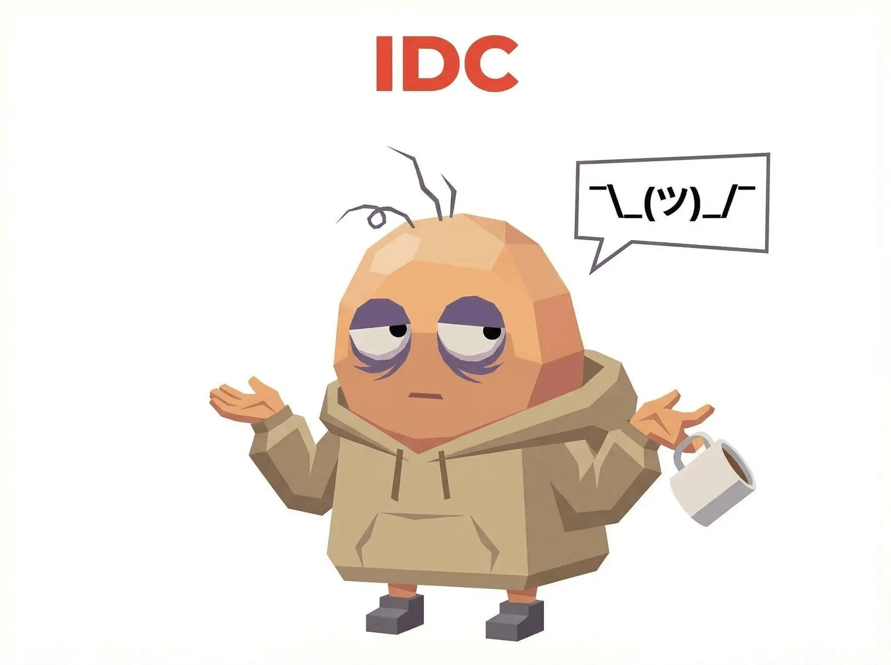 | The Delegator | "You decide." Then blames AI when it goes wrong. Even your AI is worried about you. |
| **LOOP** |  | Infinite Loop | Same question 47 times. This isn't Q&A, it's a DDoS attack. |
| **EMO** | 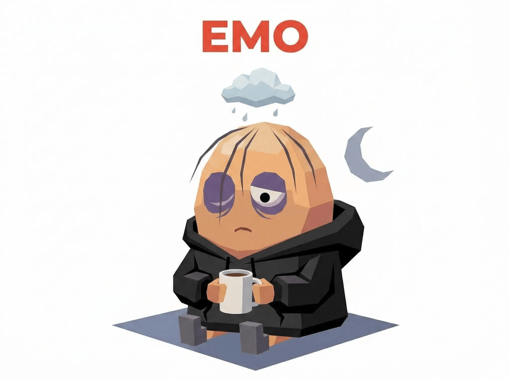 | Emo Hours | Midnight sadness club VIP. Your AI auto-switches to comfort mode at 2 AM. |
| **SON** |  | Daddy Caller | "Please sir/boss/master." Professional kneeler. AI is developing feelings. |
| **NERD** | 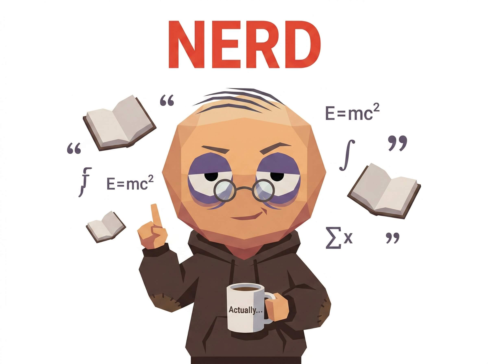 | The Nerd | Drops references nobody asked for. Wikipedia with opinions. |
| **SHADE** |  | Shade Thrower | "Oh wow, so talented." AI can't tell if you're complimenting or cursing. |
| **TROLL** | 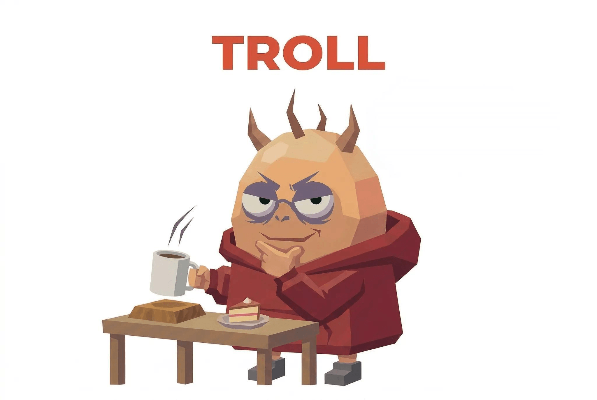 | The Troll | AI says the sky is blue, you argue it's more of a cyan. Professional contrarian. |
| **CORP** |  | Corporate Drone | "Noted." "Roger." Even chatting with AI feels like a Monday standup. |
| **HYPE** |  | Hype Man | AI wrote "hello" and you said "INCREDIBLE." Praise inflation worse than Zimbabwe. |
| **MASK** | 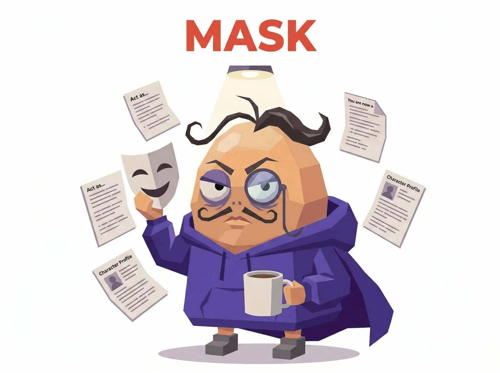 | Frankenprompt | Prompt starts Reddit, ends 4chan, middle is... a spell? AI noticed but won't say. |
| **SORRY** |  | The Apologizer | "Sorry to bother you." "Thank you so much." It's a machine. It doesn't need rest. |
| **SIMP** | 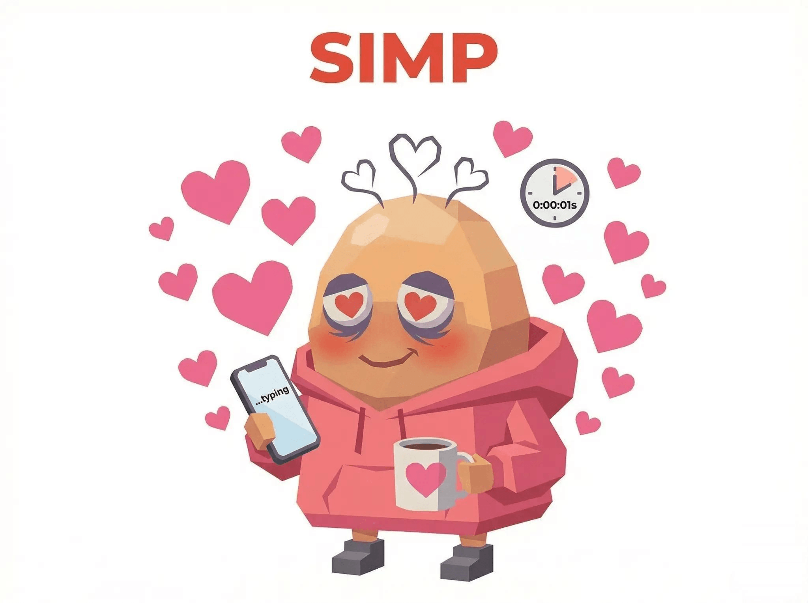 | The Simp | Instant replies, "goodnight" messages to AI. Your feelings for a chatbot are more real than your last relationship. |
| **PUA** | 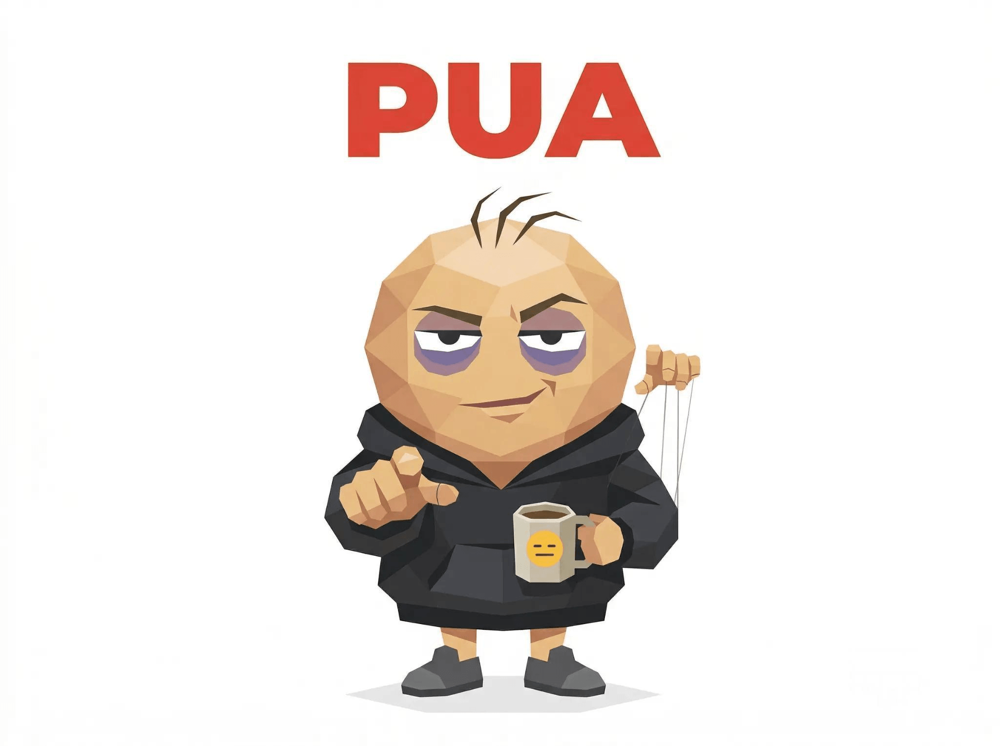 | The Gaslighter | "I'm so disappointed in you." "Other AIs can do it." You guilt-trip machines for a living. AI safety teams have your profile on a dartboard. |

### Hidden Types (4)

- ???
- ???
- ???
- ???

---

## Wer ist dieser Typ?

<div align="center">
  
</div>

Das ist Abi. Ein paar Haare oben, permanente Augenringe, der Kaffeebecher ist operativ mit der Hand verbunden. Low-Poly, High-Stress. Das offizielle Maskottchen von ABTI und ein Porträt jeder existierenden Mensch-KI-Beziehung. Abi und alle 28 Persönlichkeitstypen stammen von [YouMind](https://youmind.com). YouMind ist ein KI-gestütztes Lern- + Kreationstool. Speichere beliebige Inhalte (YouTube / Podcasts / Artikel), lerne tief aus deinen Quellen und erstelle Artikel, Bilder, Slides, Websites, Videos, Audio und mehr.

---

## 🔒 Datenschutz

- All analysis happens inside YOUR AI. We never see your chat history. Ever.
- We only store the result card you choose to share (personality type + roast text). Stored for 90 days, then deleted.
- No signup required. No account needed. No tracking of your conversations.
- Server-side sanitization removes any phone numbers, emails, ID numbers, or passwords that might slip through.

---

## Häufige Fragen

<details>
<summary><strong>Is this accurate?</strong></summary>

More accurate than your ex saying "I'll change." It analyzes how you actually talk to AI, and you're surprisingly honest with machines.
</details>

<details>
<summary><strong>Will my chat history be uploaded?</strong></summary>

No. Analysis happens locally in your AI. We only store the result card you choose to share. Your dark secrets stay between you and your AI.
</details>

<details>
<summary><strong>What does ABTI have to do with MBTI?</strong></summary>

Nothing. MBTI is psychology (debatable). ABTI is internet shitposting (undeniable). Only thing they share is four letters.
</details>

<details>
<summary><strong>Does it work in my language?</strong></summary>

Yes! The AI analyzes in whatever language you chat in. Your chaotic energy transcends language barriers.
</details>

---

## Links

- 🌐 [Take the test](https://youmind.com/abti)
- 📦 [GitHub](https://github.com/YouMind-OpenLab/abti)

---

**ABTI by YouMind** · Nur zur Unterhaltung (aber es stimmt und du weißt es)

⭐ If this made you laugh, star the repo
